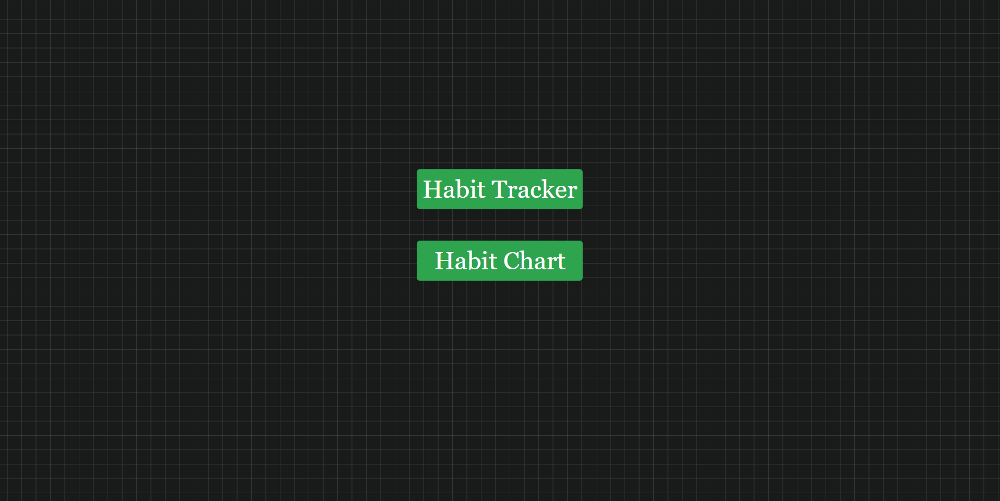
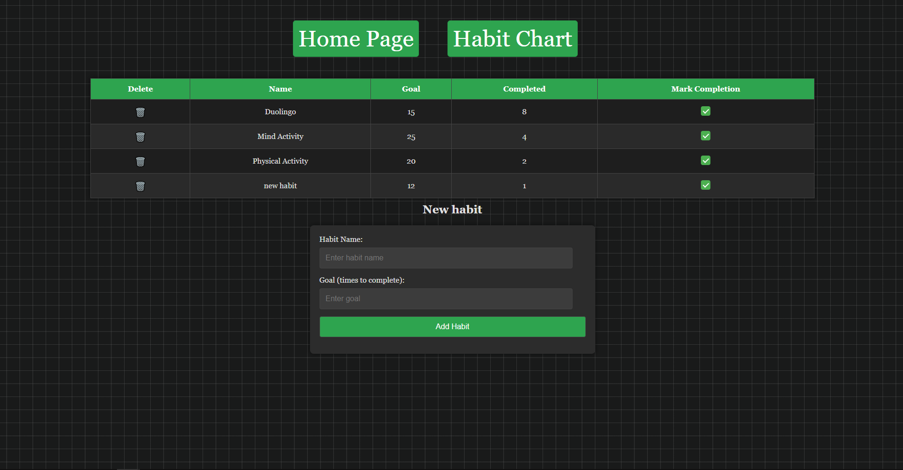
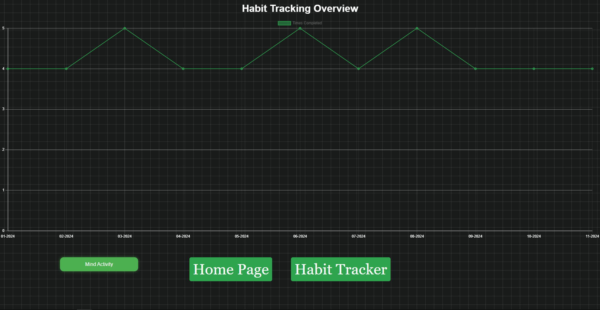
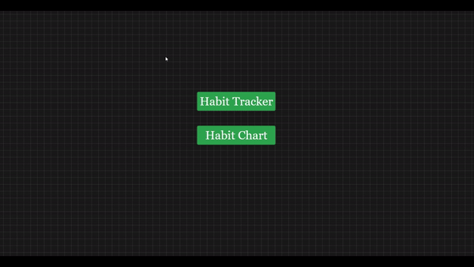

# Habit Tracker

Habit Tracker is a web-based application built with Java Spring Boot, JavaScript, HTML, and CSS.
This project helps you track your habits by allowing you to create, delete, and mark habits as completed.
You can also visualize your progress through a chart displaying completion statistics over time.

## Screenshots

### Home Page


### Habit Tracker


### Habit Chart


## How to Use the Habit Tracker
**Note**: The shown database is already populated with sample data.
<br>Here’s a quick demonstration of the app in action:



## Features

### 1. **Add Habits**
   - Users can add new habits by specifying the habit name and a completion goal.
   - A form is provided to input the habit details.

### 2. **Delete Habits**
   - Users can remove habits from their tracking list by clicking trash bin emoji.

### 3. **Mark Habit Completion**
   - Users can mark a habit as completed for the current day by clicking checkbox.
   - Completion updates the habit's progress and keeps track of completed instances.

### 4. **View Habits in a Table**
   - All active habits are displayed in a tabular format.
   - The table includes:
     - **Habit Name**: The name of the habit being tracked.
     - **Delete Button**: Allows you to remove habits from the list.
     - **Goal**: The target number of completions set for the habit.
     - **Completed Count**: Displays how many times the habit has been completed.
     - **Checkbox**: Lets you mark the habit as completed for the day.

### 5. **Chart View**
   - A separate page visualizes habit progress using a chart.
   - **X-axis**: Represents months.
   - **Y-axis**: Displays the number of times the habit was completed in a given month.
   - Users can select specific habits to analyze.

---

## Technology Stack

- **Backend**: Java Spring Boot, Thymeleaf, 
- **Frontend**: Thymeleaf, JavaScript, HTML, CSS
- **Charting Library**: Chart.js
- **Database**: PostgreSQL
- **Build Tool**: Maven 

---

## Installation


1. **Clone the Repository**
   ```bash
   git clone https://github.com/Hunter2k02/habitTracker.git
   cd habit-tracker
   ```

---
2. **Connect the Database**

3. #### **Set Up the Database**  
   Create a new database in your preferred database system (e.g., MySQL, PostgreSQL, or H2).  
   Example for MySQL:  
   ```sql
   CREATE DATABASE habit_tracker;
   ```
4. #### **Add dependencies**
   ```xml
   <dependency>
    <groupId>mysql</groupId>
    <artifactId>mysql-connector-java</artifactId>
    <scope>runtime</scope>
   </dependency>
   ```
   For PostgreSQL:
    ```xml
   <dependency>
   <groupId>org.postgresql</groupId>
   <artifactId>postgresql</artifactId>
   <scope>runtime</scope>
   </dependency>
   ```

   ```bash
   ./mvnw clean install 
   ```
5. #### **Configure the Application**
Create the application.yaml file located in src/main/resources/ with your database details.
Example for PostgresSQL:

 ```yaml
  spring:
      datasource:
        url: jdbc:postgresql://localhost:5432/name_of_your_database
        driver-class-name: org.postgresql.Driver
        username: your_username
        password: your_password
  jpa:
    hibernate:
      ddl-auto: update #Those are optional
    show-sql: true  #Those are optional

   ```

6. #### **Run the Application **
Start the Spring Boot application: 
   ```bash
   ./mvnw spring-boot:run
   ```

## Endpoints

- **Home Page**: Displays options to navigate to the Habit Tracker or Habit Chart pages.
- **Habit Tracker**: `/habit-tracker`
  - Add, delete, and mark habits as completed.
  - Habits are displayed in a table format.
- **Habit Chart**: `/chart`
  - Displays a graphical representation of habit progress over time.

---

## Future Enhancements

- Light mode.
- Export habit data to CSV or PDF.
---

## License

This project is licensed under the MIT License. See the LICENSE file for details.
